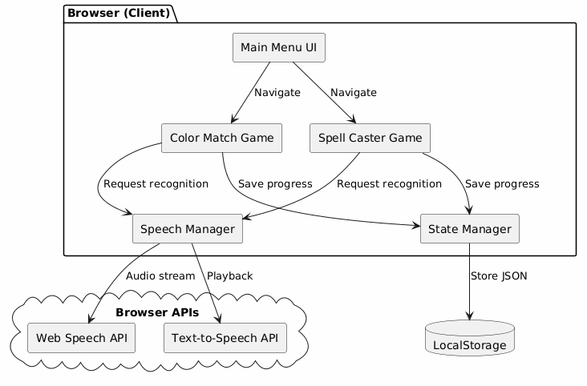
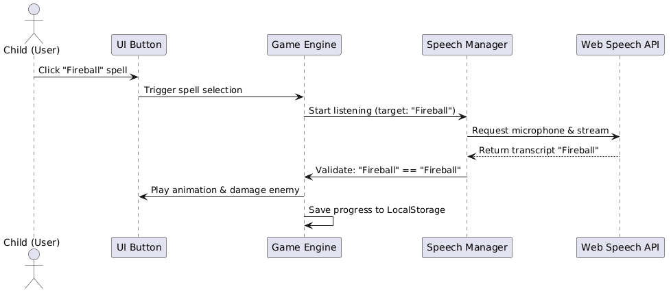
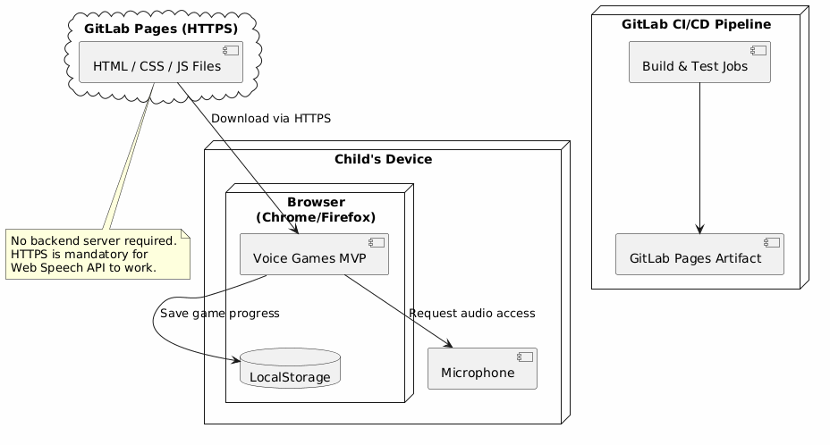

# Voice Games MVP — Architecture Documentation

This document describes the software architecture of Voice Games MVP.

## Overview

Voice Games MVP is a **frontend-only** browser-based application that helps children practice English pronunciation using the browser's native **Web Speech API**.

### Key Architectural Decisions
- **No Backend**: All data is stored in the browser's LocalStorage.
- **Client-side Speech Recognition**: Uses Web Speech API (Chrome/Firefox).
- **Static Hosting**: Deployed via GitLab Pages (HTTPS required for microphone access).

---

## 1. Static View (Component Diagram)
The following diagram shows the main components of the system:

**Explanation:**
- **Main Menu & Games**: UI components for game selection and gameplay.
- **Speech Manager**: Centralized service for voice recognition and TTS.
- **State Manager**: Handles progress saving/loading.
- **LocalStorage**: Persistent storage without a backend.

**Analysis (Coupling, Cohesion, and Quality Requirements):**
- **Coupling & Cohesion**: The system is highly modularized around specific responsibilities (high cohesion). The `Speech Manager` acts as a facade over the Web Speech API, decoupling the game logic from browser-specific speech implementations (low coupling).
- **Maintainability**: This component separation allows us to easily plug in new games without rewriting the speech recognition core logic, enhancing maintainability.
- **Quality Support**: This structure directly supports our Performance Efficiency requirement (`QR-PERF-01`) by keeping logic client-side and avoiding network latency, ensuring instant UI updates during gameplay.

---

## 2. Dynamic View (Sequence Diagram)
The following diagram shows the "select-then-speak" mechanic in Spell Caster:

**Explanation:**
This scenario represents the flow where a user explicitly selects a target (e.g., a spell) before the system begins listening for a specific speech input.
- **Why it is important**: It is the core interaction loop for the majority of our arcade games. Children using the platform get easily frustrated if the game misinterprets background noise as incorrect answers. 
- **Architectural / Integration boundaries**: This diagram highlights the integration boundary between our internal state logic and the browser's external Web Speech API. It also illustrates our architectural decision to limit the matching scope to a single expected word, rather than processing a continuous stream of free-form text.
- **Quality Requirements**: This flow specifically supports `QR-USAB-01` (User Error Protection) by ensuring the system only actively evaluates speech when the user is explicitly ready and targeting a specific interaction.

---

## 3. Deployment View
The following diagram shows how the application is deployed:

**Explanation:**
- **Why this deployment model was chosen**: We chose GitLab Pages because it provides free, zero-configuration HTTPS hosting out of the box, which is a strict security requirement imposed by modern browsers for accessing the microphone via the Web Speech API.
- **How it supports/constrains the product**: This architecture guarantees high availability and zero server-side maintenance costs, perfectly supporting a frontend-only application. However, it constrains us from implementing server-side features like cross-device syncing or competitive leaderboards without introducing a backend later.
- **Operational considerations**: When deploying, the CI/CD pipeline must ensure that all assets (JS/CSS) are bundled correctly and that the output is placed in a `public/` directory format that GitLab Pages expects. Customers only need a modern browser (Chrome/Firefox) and an active internet connection to load the static assets.

---

## Architecture Decision Records (ADRs)
The following ADRs document important architectural decisions:

- [ADR-001: Use Browser-Native Web Speech API](adr/001-use-browser-native-speech-api.md)
- [ADR-002: Client-Side State Management via LocalStorage](adr/002-client-side-localstorage-state.md)
- [ADR-003: Select-then-Speak Interaction Pattern](adr/003-select-then-speak-interaction-pattern.md)