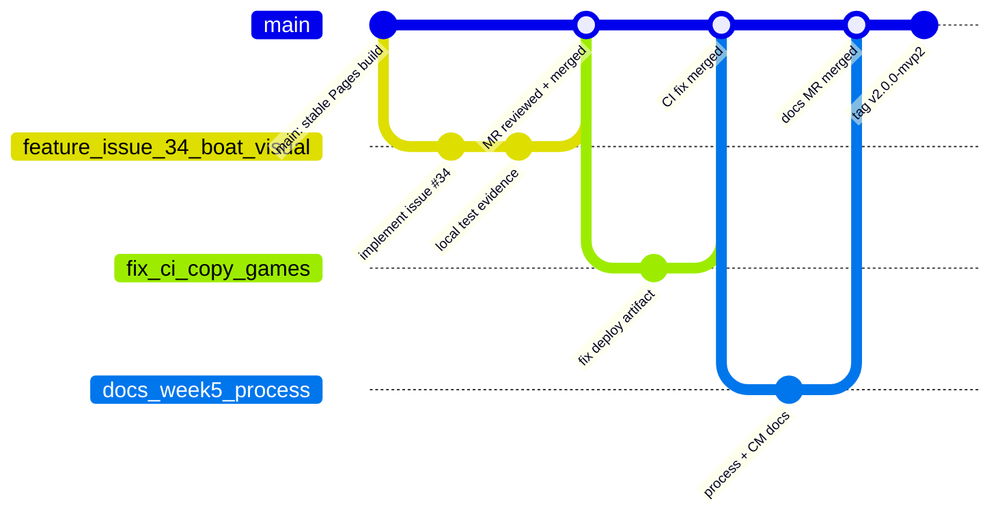

# Development Process and Configuration Management

This maintained artifact defines how the Voice Games team plans, implements, reviews, verifies, releases, and documents product work. It is the single maintained reference for the team's current actual development process and configuration-management rules. The issue tracker remains the live execution system, while this file defines the rules that the team follows in that system.

## Maintained Scope

This document governs product work in the `vg-mvp` repository, including application code, tests, CI/CD configuration, GitLab Pages deployment, maintained product documentation, and maintained workflow documentation.

The process follows the shared [Process Requirements](../Process_Requirements.md), the team [Definition of Done](definition-of-done.md), the current [roadmap](roadmap.md), the current [user-story index](user-stories.md), the [testing strategy](testing.md), and the repository automation in [.gitlab-ci.yml](../.gitlab-ci.yml).

## Repository Roles and Sources of Truth

| Area | Source of truth | Maintained evidence |
|---|---|---|
| Product backlog and Sprint execution | GitLab issues, boards, and Sprint milestones | Issue descriptions, acceptance criteria, estimates, assignees, reviewers, labels, milestone assignment |
| Stable user-story registry | [docs/user-stories.md](user-stories.md) | Stable user-story IDs, requirement status, Work Status, Sprint assignment, issue links |
| Sprint-level product direction | [docs/roadmap.md](roadmap.md) | Sprint goals, planned milestone scope, intended outcomes |
| Completion standard | [docs/definition-of-done.md](definition-of-done.md) | Review, CI, testing, documentation, and traceability gates |
| Test and quality strategy | [docs/testing.md](testing.md), [docs/quality-requirements.md](quality-requirements.md), [docs/quality-requirement-tests.md](quality-requirement-tests.md) | Unit tests, QRTs, CI artifacts, coverage and verification evidence |
| Configuration and deployment | [.gitlab-ci.yml](../.gitlab-ci.yml), GitLab Pages, protected default branch | CI pipelines, Pages artifact, release tags, branch protection screenshots in reports |
| Public course evidence | `reports/week*/README.md` and linked report files | Sanitized report summaries, screenshots, customer review evidence, reflection, retrospective |

## Scrum Cadence

The team works in weekly Sprints unless the course staff explicitly approves a different cadence. A Sprint runs from Monday to Sunday and is represented by a GitLab milestone so that the Sprint Backlog remains inspectable.

Sprint Planning produces:

- a short value-focused Sprint Goal;
- selected Sprint PBIs assigned to the Sprint milestone;
- estimates using the Modified Fibonacci scale `1, 2, 3, 5, 8, 13, 20, 40, 100`;
- one implementer and a different reviewer for each Sprint-tracked PBI;
- acceptance criteria and enough context for the PBI to start without major unanswered questions.

During the Sprint, the team holds daily developer coordination to inspect progress toward the Sprint Goal, identify blockers, and adapt the next day's plan. Sprint Review inspects the delivered product increment with the customer or stakeholder, captures feedback, and adapts the Product Backlog. Sprint Retrospective identifies concrete process improvements that are carried into the next Sprint.

## Boards, Views, and Backlogs

The Product Backlog is the single ordered source of product work. It is refined continuously, not only during Sprint Planning. The top of the backlog must remain DEEP: detailed appropriately, emergent, estimated when ready for Sprint commitment, and prioritized.

The team uses GitLab issue boards and milestones as inspectable workflow artifacts:

- Product Backlog board: `https://gitlab.pg.innopolis.university/swp-voice-games/vg-mvp/-/boards`
- Sprint Backlog board: the same board filtered by the active Sprint milestone, for example `milestone_title=Sprint 2`
- Sprint milestone: the authoritative Sprint container for Sprint Goal, dates, selected Sprint PBIs, and current workflow state
- MVP/version views: GitLab labels and release tags are used when a report must preserve evidence for a specific MVP increment

The issue tracker is the authoritative source for live issue descriptions, acceptance criteria, estimates, assignees, reviewers, labels, milestone assignment, and current execution status. Maintained repository docs summarize and index that state for traceability; they do not replace the live board.

## Product Backlog and Work Status

The team distinguishes PBIs from Course Tasks:

- PBIs improve the product repository, product behavior, maintained product documentation, or maintained workflow documentation.
- Course Tasks primarily package grading evidence, public reports, or administrative submission material.
- Files under `reports/` are Course Task artifacts by default.
- Maintained artifacts such as this file, `docs/user-stories.md`, `docs/roadmap.md`, `docs/definition-of-done.md`, root setup documentation, CI configuration, and `CHANGELOG.md` are PBIs when they improve the repository.

The team uses these Work Status values consistently. When a GitLab board uses columns, labels, or saved views, those columns must map to the same semantics:

| Work Status | Entry criteria |
|---|---|
| `To Do` | The PBI is in the Product Backlog but is not yet selected and ready for execution. It may still need clarification, estimation, acceptance criteria, assignment, or prioritization. |
| `Ready` | The PBI is selected for the current Sprint, assigned to one implementer, has a different reviewer, has an estimate, has acceptance criteria, and has enough context to start. |
| `In Progress` | The implementer has started work from the latest `main` on a scoped branch, and the issue remains linked to the active Sprint/milestone where applicable. |
| `Review` | The implementation is ready for review, the issue-linked MR is open, acceptance criteria have been checked by the implementer, and testing performed is documented in the MR. |
| `Done` | The MR is reviewed by another team member, required CI/tests/evidence are present, the MR is merged into protected `main`, the issue acceptance criteria and DoD are satisfied, and traceability links are preserved. |

For a user-story issue, `Done` additionally requires all linked supporting PBIs needed to satisfy the story acceptance criteria to be reviewed, merged, verified, and marked `Done`.

## Traceability Rules

Traceability means preserving the links between requirement, implementation, review, verification, and release evidence.

Every user story and PBI should preserve the following links where applicable:

- stable user-story ID from [docs/user-stories.md](user-stories.md);
- GitLab issue for the story or supporting PBI;
- Sprint milestone assignment;
- related implementation MR;
- tests, CI pipeline, QRT, UAT, screenshot, or manual verification evidence;
- changelog entry or release tag when the work changes the delivered product.

User-story IDs are stable. If a story is split, removed, superseded, or replaced, the team preserves the historical ID and explains the change instead of deleting the requirement history.

## Git and Review Workflow

The repository uses a protected-default-branch workflow. `main` represents the integrated, deployable state of the product. Product work is implemented on short-lived branches and merged through GitLab Merge Requests after review and CI verification. Merge commits are used for MRs; squash and rebase merging should remain disabled where GitLab settings allow it.



The diagram shows the actual team workflow:

1. `main` stays protected and deployable.
2. Each product change starts from the latest `main`.
3. The preferred branch name is issue-linked, using `<issue-number>-short-description` when created from the issue page, for example `42-add-login-form`. Existing project branches also use descriptive prefixes such as `feat/score-tracking-color-match`, `fix/deploy-wordlists-html`, `feature/color-match-game`, or `docs/week5-process`; these are acceptable when the MR clearly links the issue.
4. The implementer commits focused changes on the branch and links the branch/MR to the issue.
5. The MR moves the PBI to `Review`, collects review evidence, and runs CI.
6. A different reviewer approves the MR after checking acceptance criteria, tests, documentation, and DoD.
7. The MR is merged into `main`; the issue can move to `Done` only after the merged result satisfies acceptance criteria and the DoD.
8. Version tags and GitLab releases mark delivered Sprint increments, such as MVP releases.

## Issue, Branch, and Commit Rules

The team uses GitLab issue templates to create inspectable work items:

- User Story issues contain the stable user-story ID, statement, notes, acceptance criteria, MoSCoW priority, story points, MVP version, and reviewer.
- Other PBI issues contain issue type, description, acceptance criteria, implementer, reviewer, estimate, expected evidence, and Sprint/milestone notes.
- Bug Report issues contain reproduction steps, expected behavior, actual behavior, environment, acceptance criteria, and verification evidence.
- Course Task issues contain expected course evidence or deliverables and are explicitly marked as not PBIs.

Blank issues should stay disabled where GitLab settings support it. Non-automated changes should start from a relevant issue; automated dependency-update MRs do not need a product issue but still require review and checks.

Branches should be short-lived and scoped to one issue, fix, or documentation artifact. Recommended branch prefixes are:

- `feat/` for new product behavior;
- `fix/` for defects or CI/deployment fixes;
- `docs/` for maintained documentation changes;
- `test/` for test-only improvements;
- `chore/` for repository maintenance that does not change product behavior.

When the branch is created from an issue, prefer the repository requirement format `<issue-number>-short-description`. Prefix-style branch names are acceptable for historical or small maintenance changes when the MR links the issue and preserves traceability.

Commits should be small enough to review. Commit messages should identify the intent, such as `fix(ci): copy wordlists.html into deployment artifact` or `docs: add development process and configuration management`.

The team does not commit secrets, private credentials, generated local caches, or machine-specific configuration. Generated test and coverage outputs are kept as CI artifacts unless the repository explicitly maintains them as documentation evidence.

## Merge Request Rules

Every implementation MR should:

- link the relevant issue or PBI;
- summarize the product, documentation, test, or configuration change;
- identify testing performed;
- explicitly state how acceptance criteria were verified;
- include exactly one changelog checklist selection: either a user-visible `CHANGELOG.md` entry was added/updated or the changelog is not applicable;
- use the repository MR template;
- preserve review evidence from at least one reviewer who is not the implementer;
- pass required CI checks or explicitly document any approved temporary risk;
- update maintained documentation and `CHANGELOG.md` when the delivered product or repository process changes.

Direct pushes to `main` are not part of the normal workflow. Emergency fixes still use an MR, but the MR can be smaller and reviewed faster if needed.

After a reviewed MR is merged, the implementer or reviewer updates the linked issue. Supporting PBIs may move to `Done` only after the MR is merged to protected `main`, verification evidence is available, and the DoD is satisfied. User-story issues close only after all required linked supporting PBIs are Done.

## Configuration Management

Configuration management in this repository means controlling and documenting the files, tools, branches, environments, tests, deployment outputs, and release identifiers that define a reproducible product state.

### Controlled Items

| Configuration item | Location | Control rule |
|---|---|---|
| Product source files | `index.html`, `play.html`, `wordlists.html`, `games/` | Changed through issue-linked branches and reviewed MRs. |
| Shared game logic | `games/shared/` | Covered by unit tests and coverage threshold in `package.json`. |
| Unit and QRT tests | `tests/unit/`, `tests/qrt/` | Run locally before review when relevant and automatically in CI. |
| CI/CD pipeline | `.gitlab-ci.yml` | Reviewed as product infrastructure; changes must preserve branch CI and Pages deployment. |
| Package configuration | `package.json`, `package-lock.json` | Dependency and script changes must be reviewed and verified with `npm ci` in CI. |
| Maintained documentation | `README.md`, `CHANGELOG.md`, `docs/` | Updated with the product/process change in the same MR whenever applicable. |
| Public reports | `reports/week*/` | Sanitized course evidence, linked from public reports and copied to Pages when needed. |
| Release identifiers | Git tags and GitLab releases | Use SemVer-style Sprint increment tags such as `v2.0.0-mvp2`. |

### Secrets, Runtime Configuration, and Ignored Files

The current product is a static frontend and does not require runtime secrets, API keys, private credentials, or environment-specific server configuration. No `.env` file is required for normal local development or GitLab Pages deployment. If later product work introduces secrets or environment variables, the team must:

- store real secrets only in local developer environments or protected GitLab CI/CD variables;
- commit only sanitized examples such as `.env.example`;
- add `.env` and equivalent secret files to `.gitignore`;
- update this document, `README.md`, and deployment documentation with safe setup instructions.

The repository keeps local and generated artifacts ignored, including:

- OS/editor files such as `.DS_Store`, `.vscode/`, `.idea/`, and workspace files;
- `node_modules/` and package-manager debug logs;
- test artifacts such as `test-results/`, `playwright-report/`, `junit*.xml`, and `coverage/`;
- local Pages/build output in `public/`;
- loose screenshots, recordings, and scratch reports outside maintained `docs/` or `reports/` paths.

Public artifacts must be sanitized before commit. Raw recordings, private timecodes, credentials, customer-identifying confidential details, and private access instructions are not committed.

### Environment and Tooling Baseline

The product is a frontend-only HTML/JS/CSS application using browser Web Speech API and Text-to-Speech API features. Chrome and Firefox are the target browsers for voice features. The repository uses Node-based tooling for Jest, Playwright, static serving, and dependency locking.

The reproducible setup path is the npm lockfile workflow. Developers use the committed `package-lock.json` and install dependencies with `npm ci` so local and CI dependency resolution match. The repository does not currently use Nix, `devenv`, Docker, or a framework build step.

Local verification commands:

```bash
npm ci
npm run test:unit
npx playwright test tests/qrt/ --workers=1
npm run serve
```

The CI pipeline runs unit tests, QRTs, link checks, deployment health checks, and GitLab Pages deployment according to [.gitlab-ci.yml](../.gitlab-ci.yml).

CI is configured to run on branch pushes, merge-request events, protected default-branch changes, and manual web-triggered pipelines unless the commit message contains `[skip-ci]`. The pipeline currently includes:

- Lychee Markdown link checking;
- Jest unit tests and coverage reporting for critical shared logic;
- Playwright QRT execution with reports saved as artifacts;
- deployment health checking for GitLab Pages;
- Pages deployment from `main`.

### Deployment Configuration

GitLab Pages is the deployment target for the public MVP. The Pages job builds the `public/` artifact from the root HTML files, `games/`, maintained `docs/`, public `reports/`, and selected root project documents. The deployed site must remain accessible over HTTPS because microphone permissions and Web Speech API behavior depend on secure browser contexts.

The project uses deployment automation/continuous delivery to GitLab Pages: every successful `main` pipeline publishes the latest `public/` artifact. The deployment artifact is configuration-managed: if a product page, shared game asset, documentation page, or report must be public, the MR must ensure the Pages job copies it into `public/`.

## Verification and Quality Gates

The team applies the [Definition of Done](definition-of-done.md) to every PBI. At minimum:

- acceptance criteria are satisfied;
- another team member reviewed and approved the MR;
- relevant unit, integration, QRT, or manual tests are performed;
- required CI checks pass or an approved temporary risk is documented;
- verification evidence is preserved in the MR, CI pipeline, report, or linked documentation;
- documentation and changelog entries are updated when applicable.

Quality gates include:

- Jest unit tests for shared game logic with the configured coverage threshold;
- Playwright QRTs for performance, reliability, and user-error protection;
- Lychee link checking for Markdown documentation;
- GitLab Pages deployment and HTTP status checks for published artifacts.

Assignment 4 quality gates remain active for later work. If the team replaces a check, narrows a test, or changes the critical-module baseline, the MR must document the reason and update the maintained testing documentation.

## Release and Versioning

The team uses SemVer-style release identifiers for Sprint increments. A release should include:

- a tag that identifies the delivered increment;
- the merged `main` state used for release;
- a changelog entry;
- a public report link;
- verification evidence such as CI pipeline, screenshots, QRT results, or UAT summary.

Examples already used by the project include `v1.0.0-MVP` for MVP v1 and `v2.0.0-mvp2` for the Assignment 4 Sprint increment.

## Maintenance Checklist

When the process or repository configuration changes, update this document in the same MR. Before marking the related PBI `Done`, check:

- [ ] GitLab issue has acceptance criteria, implementer, reviewer, estimate, and Sprint milestone if Sprint-selected.
- [ ] Branch name and MR identify the issue or artifact being changed.
- [ ] MR summary explains the change and testing performed.
- [ ] CI, tests, or documented manual verification cover the change.
- [ ] `README.md`, `docs/`, `reports/`, and `CHANGELOG.md` are updated when the change affects them.
- [ ] Traceability links connect issue, MR, tests/evidence, and maintained documentation.
- [ ] The merged result is on `main` before the PBI moves to `Done`.
