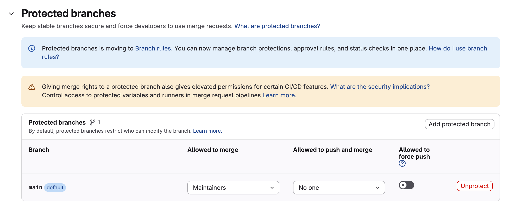
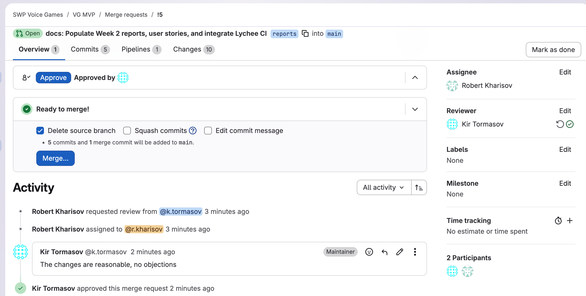
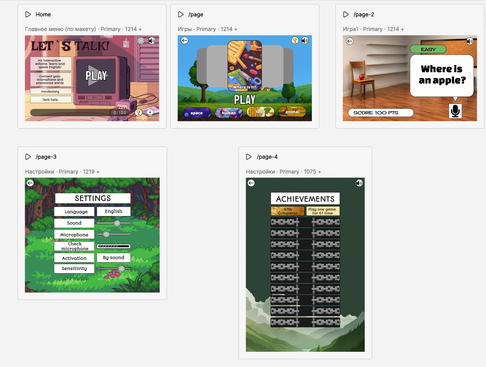
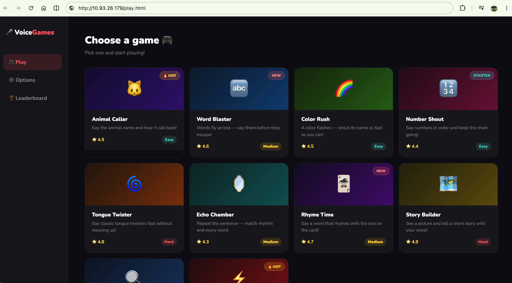

# Voice Games MVP

## 1. Project Information
* **Project Name:** Voice Games MVP
* **Description:** A browser-based web application featuring voice-controlled mini-games designed to help children practice and improve their English pronunciation.
* **License:** [MIT License](../../LICENSE)

## 2. User Stories
* [User Stories & Priorities (MoSCoW)](user-stories.md)

## 3. Prototype and Interface Artifacts
* **Graphical Interface Prototype:** [Figma Interactive Prototype](https://www.figma.com/site/5OfdSFtJ1E5kaLBOwOCE8A/SWP?node-id=0-3&t=CULSpJEYFP6xgeHY-1)
* *Note: The prototype requires no authentication and is configured for public view-only access.*

## 4. MVP v0 Deployment
* **MVP v0 Report:** [mvp-v0-report.md](mvp-v0-report.md)
* **Live Deployment URL:** [link](http://10.93.26.179/play.html)
* **Public Video Demonstration:** [Goodle Drive link](https://drive.google.com/file/d/1QzNwz6QIoRrjd3dLMB9KvVxvpjkYPx8k/view?usp=sharing)

## 5. PR/MR Workflow
* **PR/MR Template:** [merge_request_template.md](../../.gitlab/merge_request_templates/merge_request_template.md)
* **Example Reviewed MR:** https://gitlab.pg.innopolis.university/swp-voice-games/vg-mvp/-/merge_requests/27

## 6. Lychee Link Checking
* **Lychee Configuration:** [lychee.toml](../../lychee.toml)
* **Latest Successful CI Run:** [GitLab Pipeline Jobs](https://gitlab.pg.innopolis.university/swp-voice-games/vg-mvp/-/pipelines) *(Note: specific job link will be available upon merge)*

## 7. Excluded Lychee Links
* `https://www.figma.com/site/5OfdSFtJ1E5kaLBOwOCE8A/SWP?node-id=0-1&t=MuPcREqSjN7pkE5U-1` - Justification: Requires browser JS rendering and specific headers to resolve correctly, triggering a rate limit/403 error in standard curl/Lychee checks. Manually verified as accessible in incognito mode.

## 8. Artifact Screenshots
* **Protected Default Branch Settings:**  
  

* **Example Reviewed MR:**  
  

* **Figma Prototype Interface:**  
  

* **Deployed MVP v0:**  
  

## 9. Coverage
* **Prototype Coverage:** The Figma interactive prototype visualizes the core layout, menu navigation, and game interface. Specifically, it covers **US-01** (game selection), **US-04** (speaking interface via microphone button), **US-06** (phrase practice layout), **US-09** (vocabulary category filters), **US-10** (progress bar), and **US-15** (achievements screen).
* **MVP v0 Coverage:** The MVP v0 establishes the technical deployment foundation and smoke-checks the frontend routing and UI layout, acting as a technical precursor to US-01 (Select a Game). The full navigation scenario is documented in the [MVP v0 Report](mvp-v0-report.md).

## 10. Customer Meeting Transcript
* [Customer Meeting Transcript](customer-meeting-transcript.md)

## 11. Customer Meeting Summary
* [Customer Meeting Summary](customer-meeting-summary.md)

## 12. Week 2 Analysis
* [Week 2 Analysis](analysis.md)

## 13. LLM Usage Report
* [Report on LLM Usage](llm-report.md)